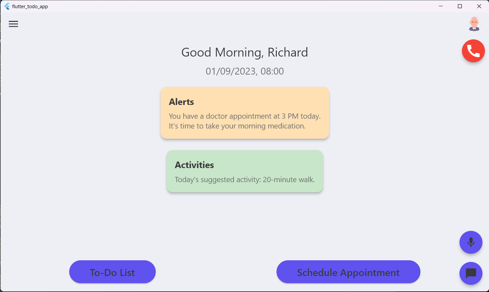

# Système d'assistance personnelle basé sur l'intelligence artificielle pour les personnes âgées

Ce projet est une application Flutter idéalement sur les Tablettes et Ipad, conçue pour aider les personnes âgées dans leur vie quotidienne. Les principales fonctionnalités de cette application sont :

## 1. Écran d'accueil
L'écran d'accueil offre un aperçu des activités quotidiennes et des alertes pour l'utilisateur. L'utilisateur peut également naviguer vers d'autres fonctionnalités à partir de l'écran d'accueil.

Cet écran est conçu pour être simple et intuitif, avec une grande police et des boutons facilement cliquables pour aider les personnes âgées qui ne sont pas habituées à la technologie.

## 2. Liste de tâches (To-do List)
La fonctionnalité de liste de tâches permet à l'utilisateur de gérer ses tâches quotidiennes. Ils peuvent ajouter de nouvelles tâches, marquer les tâches comme terminées et voir leurs tâches actuelles de manière organisée. Cette fonction est particulièrement utile pour les personnes âgées qui peuvent avoir des difficultés à se souvenir de leurs tâches quotidiennes. L'utilisation régulière de cette liste de tâches peut aider à améliorer leur mémoire et leur rappeler les tâches importantes qu'ils doivent accomplir.

## 3. Assistant virtuel
La fonction d'assistant virtuel offre aux utilisateurs une manière d'interagir avec l'application sans utiliser leurs mains. En appuyant longuement sur le bouton "Appuyez pour parler", les utilisateurs peuvent donner des commandes vocales à l'assistant IA.

## 4. Communication
Avant d'accéder à la fonctionnalité de communication, l'utilisateur est présenté à une liste de contacts préenregistrés, habituellement des proches ou des soignants. L'utilisateur peut alors choisir avec qui il souhaite communiquer. Cette fonctionnalité permet à l'utilisateur d'envoyer et de recevoir des messages textuels. Cette fonctionnalité est particulièrement importante pour les personnes âgées qui peuvent souvent se sentir isolées. En ayant la possibilité de chatter facilement avec leurs proches, ils peuvent rester connectés et engagés, ce qui contribue à réduire les sentiments de solitude.

##  5. Télémedecine
La fonction de télémedecine permet aux utilisateurs de mettre en place et de gérer des rendez-vous médicaux virtuels. Le programme des rendez-vous est affiché et offre un accès facile pour rejoindre un appel. L'utilisateur peut également programmer un nouveau rendez-vous en appuyant sur le bouton "Planifier un nouveau rendez-vous".

## 6. Bouton d'urgence
Le bouton d'urgence est un grand bouton visible placé dans le coin supérieur droit de la page d'accueil l'application. En appuyant dessus, cela déclencherait immédiatement un appel vers les services d'urgence ou un contact désigné.

